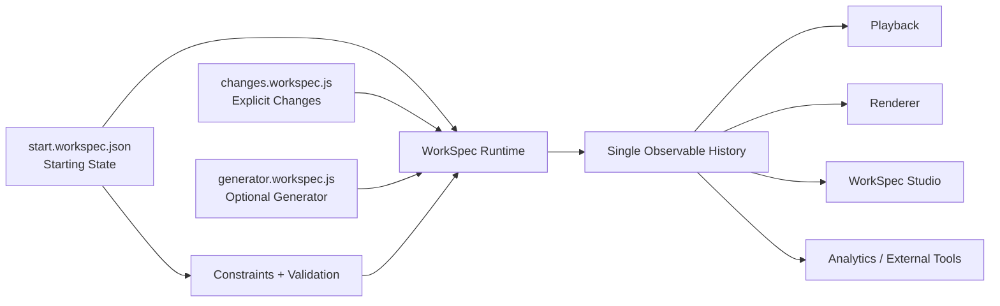

<p align="center">
  
</p>

# Universal Automation Wiki

**Universal Automation Wiki (UAW)** is an open-source project for representing, simulating, validating, and inspecting real-world work.

At its core is **WorkSpec**: a format for describing a world, defining how that world changes over time, and producing one observable history that tools can replay and analyse.

**WorkSpec Studio** is the visual authoring and inspection environment built on top of that core.

[Try WorkSpec Studio](https://universalautomation.wiki/playground.html) · [Explore UAW](https://universalautomation.wiki) · [WorkSpec package](packages/workspec)

---

## The idea

Most workflow tools describe a sequence of tasks.

UAW models the state of the real world over time: what exists, where it is, what condition it is in, and how that state changes as work is performed.

A WorkSpec project can describe:

- people, machines, resources, locations, and other objects;
- the starting state of those objects;
- planned tasks, timing, and dependencies;
- explicit changes caused by known events;
- optional simulation logic for behaviour that must be generated;
- constraints that detect invalid or impossible states; and
- the resolved history that a player, renderer, debugger, or analysis tool can inspect.

The long-term goal is to make real work structured enough that humans and AI systems can inspect it, simulate it, test assumptions, and improve it.

## WorkSpec

WorkSpec is the reusable technical core of UAW.

It is deliberately **not** a new general-purpose programming language. Declarative world data stays in JSON, whereas logic lives in JavaScript. Playback and rendering work using the resolved WorkSpec state/history instead of implementing a second simulation runtime.


A project has three main authoring files:

| File | Purpose |
| --- | --- |
| `start.workspec.json` | Declarative starting state: world, objects, layouts, configuration, tasks, timing, and dependencies. |
| `changes.workspec.js` | Explicit authored changes tied to known task events. |
| `generator.workspec.js` | Optional simulation/generator logic for state that must evolve dynamically. |

A Studio project can package these files, assets, and project metadata into a `.workspec.zip` archive.

## Architecture



The important boundary is the **observable history**.

Changes and generator output resolve into the same history. Playback tools consume that result instead of re-running authoring logic themselves. This keeps the representation independent from WorkSpec Studio and makes it possible for other tools to generate, validate, manipulate, or render WorkSpec projects.

### 1. Starting State

`start.workspec.json` contains the declarative model.

It can define the world, objects, object properties, locations, tasks, schedules, dependencies, layouts, state libraries, and other configuration required to understand the simulation.

Executable effects do not belong in the Starting State.

```json
{
  "simulation": {
    "schema_version": "2.2",
    "meta": {
      "title": "Bakery example",
      "description": "A small WorkSpec project",
      "domain": "food-production"
    },
    "world": {
      "objects": [
        {
          "id": "mixer",
          "type": "equipment",
          "name": "Mixer",
          "properties": {
            "state": "clean",
            "temperature": 20
          }
        }
      ]
    },
    "tasks": [
      {
        "id": "mix_dough",
        "name": "Mix dough",
        "start": 0,
        "duration": 10
      }
    ]
  }
}
```

### 2. Explicit Changes

`changes.workspec.js` defines known effects of planned events.

Task handlers can use WorkSpec helpers such as `set`, `change`, `move`, `create`, and `remove`.

```js
WorkSpec.task("mix_dough", task => {
    task.onStart(() => {
        set("mixer", "state", "in_use", { temporary: true });
    });

    task.onComplete(() => {
        set("mixer", "state", "dirty");
    });
});
```

This layer is for changes the author already knows should happen.

### 3. Generator

`generator.workspec.js` is optional.

It handles behaviour that must be produced during simulation rather than authored as a fixed task effect.

```js
WorkSpec.onStart(({ set }) => {
    set("mixer", "temperature", 20);
});

WorkSpec.onUpdate(({ get, set, random }) => {
    const drift = random() < 0.5 ? -1 : 1;

    set(
        "mixer",
        "temperature",
        get("mixer", "temperature") + drift
    );
});
```

The current runtime uses deterministic minute-based updates and a seeded `random()` helper. The seed is runtime metadata, so a simulation can be reproduced without pretending randomness is part of the world state.

At one logical time, completion Changes resolve first, Generator resolves second, task decisions observe the generated state, and task-start Changes resolve last. Generator owns any same-property cross-source conflict and the runtime reports a warning.

## Constraints and validation

WorkSpec separates **state**, **behaviour**, and **constraints**.

Constraints describe what must be true. They should detect invalid or inconsistent models rather than silently changing the project to make it pass.

The WorkSpec package includes:

- a JSON Schema for the declarative Starting State;
- semantic validation beyond schema checks;
- RFC 7807 Problem Details output;
- support for custom JavaScript validators; and
- a headless CLI suitable for local development and CI.

This makes validation a reusable part of the format rather than a feature that exists only inside Studio.

## State-driven visuals

WorkSpec models semantic state separately from visual appearance.

A project can define reusable **State Libraries** that map object states to project assets. For example, an actor may have `available` and `working` states, with a different sprite for each.

The simulation remains the source of truth. A renderer only needs to resolve the object state at a given time and select the corresponding visual asset.

This allows the same WorkSpec history to support timeline views, diagrams, game-like visualisations, or other renderers without moving simulation logic into the UI.

## WorkSpec Studio

**WorkSpec Studio** is the main visual environment for building and inspecting WorkSpec projects.

Studio currently brings together:

- Starting State, Changes, and Generator editors;
- Monaco-based source editing;
- project validation and problem reporting;
- object and task editing;
- timeline and temporal navigation;
- visual playback of resolved world state;
- state-driven object appearances;
- custom constraints and constraint libraries;
- project import/export; and
- persistent project/workspace settings.

Studio is intentionally not the definition of WorkSpec. The format, runtime, validator, and playback model are designed so they can also be used headlessly or embedded in other tools.

[Open WorkSpec Studio](https://universalautomation.wiki/playground.html)

## CLI

The WorkSpec CLI requires **Node.js 18 or newer**.

Install it globally:

```bash
npm install -g workspec
```

Then:

```bash
workspec --help
```

### Validate

```bash
workspec validate path/to/start.workspec.json
```

Machine-readable output:

```bash
workspec validate path/to/start.workspec.json --json
```

Treat warnings as failures:

```bash
workspec validate path/to/start.workspec.json --fail-on-warning
```

### Custom validation

```bash
workspec validate path/to/start.workspec.json \
  --custom path/to/custom-validator.js \
  --custom-catalog path/to/metrics-catalog-custom.json
```

Custom validators execute user-provided JavaScript. Interactive runs require confirmation before the code executes. Use `--yes` for trusted non-interactive environments such as CI.

### Format

```bash
workspec format path/to/start.workspec.json --write
```

### Migrate older files

```bash
workspec migrate legacy.json --out migrated.workspec.json --schema
```

## Use WorkSpec as a library

The package also exposes the validator, runtime, playback helpers, and state visual helpers programmatically.

```js
const { runtime } = require("workspec");

const result = runtime.runProject(
    startingState,
    changesSource,
    generatorSource,
    { seed: 1234 }
);
```

The runtime produces the single observable history used by playback.

For pure playback, tools can build a reusable playback model and resolve state at arbitrary times without replaying authoring interactions.

## Development

Clone the repository:

```bash
git clone https://github.com/JamieM0/uaw.git
cd uaw
```

Run the WorkSpec test suite:

```bash
cd packages/workspec
npm test
```

The package source lives in [`packages/workspec`](packages/workspec). Browser copies used by Studio are synchronised from the package source rather than maintained as a separate implementation.

## Project structure

```text
uaw/
├── packages/
│   └── workspec/          # WorkSpec runtime, validator, CLI, schemas, and tests
├── web/                   # WorkSpec Studio and the UAW web interface
├── metrics/               # Validation/metric definitions and supporting data
├── routines/              # UAW generation and automation routines
├── templates/             # Site/content templates
├── docs-md/               # Project documentation
└── README.md
```

The repository still contains earlier UAW systems and historical WorkSpec versions. Those are useful context, but new WorkSpec development should target the current WorkSpec 2 architecture rather than treating the older executable-workflow model as the foundation.

## Design principles

WorkSpec development follows a few strong boundaries:

- **Keep the foundation small.** Stable formats and playback contracts should change less often than Studio.
- **Separate representation from generation.** A WorkSpec project can be authored manually or generated by code; downstream tools should not care which.
- **Use existing languages for computation.** JavaScript handles behaviour instead of embedding another programming language inside JSON.
- **Keep one observable history.** Studio, renderers, and analytics should inspect the same resolved state.
- **Fail explicitly.** Invalid dependencies, impossible state, and constraint failures should be reported rather than silently repaired.
- **Keep tools modular.** The validator, runtime, generator, renderer, and Studio should remain usable as separate components.
- **Preserve reproducibility.** Generated behaviour should be deterministic when given the same project and seed.

## Where UAW fits

WorkSpec is the representation and simulation infrastructure.

UAW is the broader application of that infrastructure to real-world automation: building a shared, inspectable body of knowledge about how work is performed, what state changes it requires, what constraints apply, and where automation can replace or assist human effort.

That means the project can grow in two directions without coupling them together:

1. **WorkSpec** can become a stable format and toolchain for modelling stateful real-world processes.
2. **Universal Automation Wiki** can build a community knowledge and automation layer on top of that format.


## Current direction

The current development direction is to strengthen the separation between the stable WorkSpec foundation and the tools built above it.

Areas of active development include:

- richer constraints and validation;
- more capable generator/simulation behaviour;
- better execution traces and time-based debugging;
- simpler state-driven visual systems;
- embeddable playback and rendering;
- external tooling around the WorkSpec format; and
- using WorkSpec as the structured simulation layer for UAW automation knowledge.

## Contributing

Issues and pull requests are welcome.

When changing WorkSpec, prefer changes that keep the core representation simple and reusable outside Studio. Avoid moving authoring behaviour into declarative JSON or adding renderer-specific logic to the runtime model.

For bugs, proposals, and development tasks, use [GitHub Issues](https://github.com/JamieM0/uaw/issues).

## Licence

Unless explicitly stated otherwise, this project is licensed under the **GNU Affero General Public License v3.0 (AGPL-3.0)**.

See [`LICENSE`](LICENSE) and the licence information in individual packages for details.

Thank you for your interest in the Universal Automation Wiki! Join us in building the future of interactive automation simulation.
