# UAW Documentation

## Table of Contents

- [Architecture Overview](#page-1)
- [Simulation and Playground](#simulation-and-playground)
- [Core Utilities and Functionality](#page-2)
- [Example Workflows and Use Cases](#page-3)
- [Extending and Customizing Routines](#page-4)
- [Natural Language Processing and Simplification](#page-5)
- [Search Query Generation and Information Retrieval](#page-6)

---

<a id='simulation-and-playground'></a>
## Simulation and Playground

The Universal Automation Wiki includes a powerful, interactive Simulation Playground for creating, editing, and validating process simulations.

- **[Playground Guide](./playground/playground-guide.md)**: A comprehensive overview of the playground's features and a deep dive into the `simulation.json` schema.
- **[Space Editor Guide](./playground/space-editor-guide.md)**: A guide to the visual tool for defining the physical layout of your simulation.
- **[Saving and Loading Simulations](./playground/save-load.md)**: Instructions on how to save your simulations locally or to the cloud.
- **[The Metrics Editor](./simulations/metrics-editor.md)**: A detailed guide on how to create your own custom validation logic.

<a id='page-1'></a>

## Architecture Overview

### Related Files

- `assemble.py`
- `utils.py`
- `automation-adoption.py`

### Related Pages

Related topics: [Core Utilities and Functionality](#page-2), [Example Workflows and Use Cases](#page-3)

### Architecture Overview

This document provides an overview of the architecture of the `routines` repository, focusing on `assemble.py`, `utils.py`, and `automation-adoption.py`.  It details their purpose, functionality, and relationships within the system.

#### 1. Purpose and Functionality

*   **`assemble.py`**: This script likely contains the main program logic for assembling or orchestrating different routines or tasks.  It might involve reading input data, calling various functions from other modules (like `utils.py`), and generating output.

*   **`utils.py`**: This module serves as a collection of utility functions used throughout the project.  These functions could include file I/O, data manipulation, string processing, or any other common tasks needed by multiple scripts.

*   **`automation-adoption.py`**: This script focuses on generating and analyzing automation adoption phases for a given topic. It uses a Large Language Model (LLM) to create a structured breakdown of automation, from basic mechanical assistance to full end-to-end automation.

#### 2. Code Examples and Explanations

##### `assemble.py` (Hypothetical Example)

```python
# assemble.py
import utils

def main():
    input_data = utils.load_json("input.json")
    processed_data = utils.process_data(input_data)
    utils.save_output(processed_data, "output.json")

if __name__ == "__main__":
    main()
```

Explanation: This example demonstrates how `assemble.py` might use functions from `utils.py` to load data, process it, and save the output.

##### `utils.py` (Example)

```python
# utils.py
import json

def load_json(filepath):
    with open(filepath, 'r') as f:
        return json.load(f)

def save_output(data, filepath):
    with open(filepath, 'w') as f:
        json.dump(data, f, indent=4)

def process_data(data):
    # Example data processing logic
    return {k: v.upper() for k, v in data.items()}
```

Explanation: This code shows example utility functions for loading JSON data, saving output, and processing data.  The `process_data` function converts all values in a dictionary to uppercase.

##### `automation-adoption.py` (Key Functions)

```python
# automation-adoption.py
import json
from utils import chat_with_llm, parse_llm_json_response, saveToFile

flowUUID = None # Global variable for flow UUID

def generate_automation_adoption(input_data, save_inputs=False):
    """Generate detailed information about automation adoption phases for a specific topic."""
    # Extract information from input data
    topic = input_data.get("topic", "")
    model = input_data.get("model", "gemma3")
    parameters = input_data.get("parameters", {})

    # Generate automation adoption phases using LLM
    systemMsg = (
        "You are an AI assistant specialized in analyzing automation adoption patterns. "
        "Your task is to identify and explain the different phases of automation adoption "
        "in a specific field or topic, from basic mechanical assistance to full end-to-end automation."
    )

    user_msg = (
        f"Create a detailed breakdown of automation adoption phases for: {topic}\n\n"
        "Please structure your response in 4 phases:\n"
        "Phase 1: Basic Mechanical Assistance (Currently widespread)\n"
        "Phase 2: Integrated Semi-Automation (Currently in transition)\n"
        "Phase 3: Advanced Automation Systems (Emerging technology)\n"
        "Phase 4: Full End-to-End Automation (Future development)\n\n"
        "For each phase:\n"
        "1. Provide 4-6 specific examples of automation technology or processes\n"
        "2. Make sure the automation complexity increases with each phase\n"
        "3. Be specific to the domain rather than generic\n\n"
        "Format your response as a JSON object with the following structure:\n"
        "{\n"
        "  \"phase1\": {\n"
        "    \"title\": \"Basic Mechanical Assistance\",\n"
        "    \"status\": \"Currently widespread\",\n"
        "    \"examples\": [\"example1\", \"example2\", ...]\n"
        "  },\n"
        "  \"phase2\": { ... },\n"
        "  \"phase3\": { ... },\n"
        "  \"phase4\": { ... }\n"
        "}\n\n"
        "Only include examples that are significantly relevant to the topic."
    )

    # Save inputs to file if requested
    if save_inputs:
        save_path = f"flow/{flowUUID}/inputs/5-in.json"
        saveToFile(systemMsg, user_msg, save_path)

    # Use chat_with_llm to generate automation adoption phases
    response = chat_with_llm(model, systemMsg, user_msg, parameters)

    try:
        # Try to parse JSON response
        adoption_phases = parse_llm_json_response(response)
        return adoption_phases
    except json.JSONDecodeError:
        print("Error: LLM response is not valid JSON. Full response: " + response)
        return None
```

Explanation:

*   `generate_automation_adoption`: This function takes input data (including a topic, model, and parameters), constructs system and user messages for an LLM, calls the LLM using `chat_with_llm` (likely from `utils.py`), and parses the JSON response.  It handles potential JSON decoding errors.
*   It uses `utils.saveToFile` to save inputs if requested.
*   It relies on `utils.parse_llm_json_response` to reliably extract a JSON block from the LLM response.

#### 3. Architectural Fit

The scripts fit together in a modular architecture:

*   `assemble.py` acts as the entry point, orchestrating the overall process.
*   `utils.py` provides reusable functions for common tasks, promoting code reuse and maintainability.
*   `automation-adoption.py` encapsulates the specific logic for generating automation adoption phases, making it a self-contained component.

Here's a Mermaid diagram illustrating the component relationships:

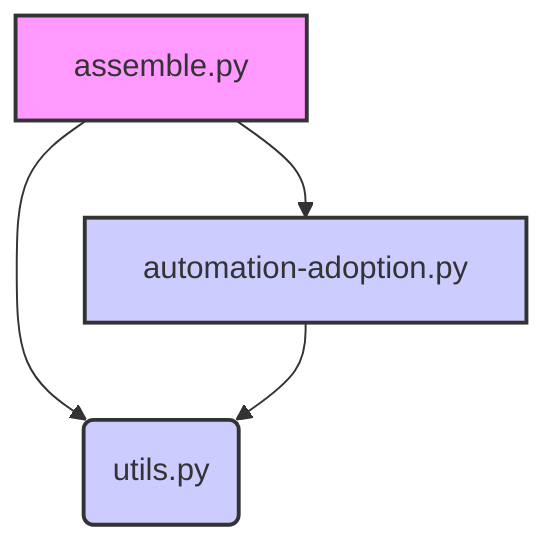

Explanation: `assemble.py` depends on both `utils.py` and `automation-adoption.py`. `automation-adoption.py` also uses functions from `utils.py`.

#### 4. Setup and Usage Instructions

1.  **Installation:** Ensure you have Python installed. Install any necessary dependencies (e.g., requests for `chat_with_llm`).
2.  **Configuration:** Configure the LLM connection details (API key, endpoint) within `utils.py` or a separate configuration file.
3.  **Usage:**

    *   For `assemble.py`, create an `input.json` file with the required input data.  Run the script: `python assemble.py`.
    *   For `automation-adoption.py`, create an input JSON file specifying the topic, model, and parameters.  Then, modify the `main()` function in `automation-adoption.py` to load your input file and call `generate_automation_adoption`.  Run the script: `python automation-adoption.py`.

#### Data Flow Diagram

This Mermaid diagram shows the data flow in `automation-adoption.py`:

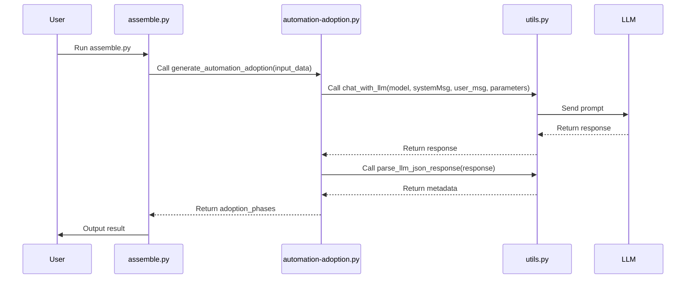

Explanation:

1.  The user runs `assemble.py`, which calls `generate_automation_adoption` in `automation-adoption.py`.
2.  `automation-adoption.py` calls `chat_with_llm` in `utils.py` to interact with the LLM.
3.  The LLM returns a response to `utils.py`, which passes it back to `automation-adoption.py`.
4.  `automation-adoption.py` uses `parse_llm_json_response` to extract the JSON.
5.  The result is returned to `assemble.py` and then to the user.


---

<a id='page-2'></a>

## Core Utilities and Functionality

### Related Files

- `utils.py`
- `prompt.py`
- `reconstructor.py`

### Related Pages

Related topics: [Architecture Overview](#page-1), [Example Workflows and Use Cases](#page-3)

# Core Utilities and Functionality

This page details the core utilities and functionality provided by the `utils.py`, `prompt.py`, and `reconstructor.py` files within the `routines` repository. These components offer essential tools for various tasks within the larger system.

## 1. Purpose and Functionality

*   **`utils.py`**: Contains general-purpose utility functions used throughout the project. This includes helper functions for file I/O, data manipulation, and other common tasks.
*   **`prompt.py`**: Focuses on generating prompts for Large Language Models (LLMs). It provides functions to construct prompts based on predefined templates and input data.
*   **`reconstructor.py`**: Implements functionality to parse and reconstruct data, specifically JSON responses from LLMs. This is crucial for reliably extracting structured information from the text-based output of LLMs.

## 2. Code Examples and Explanations

### `utils.py`

Example function (assuming a function `load_json` exists in `utils.py`):

```python
# utils.py
import json

def load_json(filepath):
    """Loads JSON data from a file.

    Args:
        filepath (str): The path to the JSON file.

    Returns:
        dict: The loaded JSON data as a dictionary.
        None: If the file does not exist or contains invalid JSON.
    """
    try:
        with open(filepath, 'r') as f:
            data = json.load(f)
        return data
    except FileNotFoundError:
        print(f"Error: File not found at {filepath}")
        return None
    except json.JSONDecodeError:
        print(f"Error: Invalid JSON in file {filepath}")
        return None
```

Explanation:

This function attempts to open and parse a JSON file. It includes error handling for common issues like the file not existing or containing invalid JSON.  Error messages are printed to the console, and `None` is returned to indicate failure.

### `prompt.py`

Example function:

```python
# prompt.py

def create_prompt(template, data):
    """Creates a prompt by substituting data into a template.

    Args:
        template (str): The prompt template with placeholders.
        data (dict): A dictionary containing the data to substitute.

    Returns:
        str: The formatted prompt.
    """
    try:
        prompt = template.format(**data)
        return prompt
    except KeyError as e:
        print(f"Error: Missing key in data: {e}")
        return None
```

Explanation:

This function takes a prompt template string and a dictionary of data. It uses the `format()` method to substitute the values from the dictionary into the placeholders in the template.  Error handling is included to catch missing keys.

### `reconstructor.py`

Example function:

```python
# reconstructor.py
import json
import re

def parse_llm_json_response(response):
    """
    Extracts a JSON object from a string response, handling potential surrounding text.

    Args:
        response (str): The string containing the JSON object.

    Returns:
        dict: The extracted JSON object as a dictionary, or None if extraction fails.
    """
    try:
        # Use regex to find the JSON-like substring
        match = re.search(r"\{.*\}", response, re.DOTALL)  # Match JSON-like structures
        if match:
            json_str = match.group(0)
            # Attempt to parse the JSON string
            data = json.loads(json_str)
            return data
        else:
            print("Error: No JSON object found in the response.")
            return None
    except json.JSONDecodeError as e:
        print(f"Error decoding JSON: {e}")
        return None
    except Exception as e:
        print(f"An unexpected error occurred: {e}")
        return None
```

Explanation:

This function attempts to extract a valid JSON object from a larger text string, which is a common scenario when working with LLMs. It uses regular expressions to find a JSON-like substring and then attempts to parse it using `json.loads()`. Robust error handling is included to catch invalid JSON or other unexpected errors.

## 3. Integration into Overall Architecture

These utilities serve as foundational components for interacting with and processing data from LLMs. `prompt.py` prepares the input for the LLM, while `reconstructor.py` processes the LLM's output.  `utils.py` provides general helper functions needed throughout the process, such as file I/O.

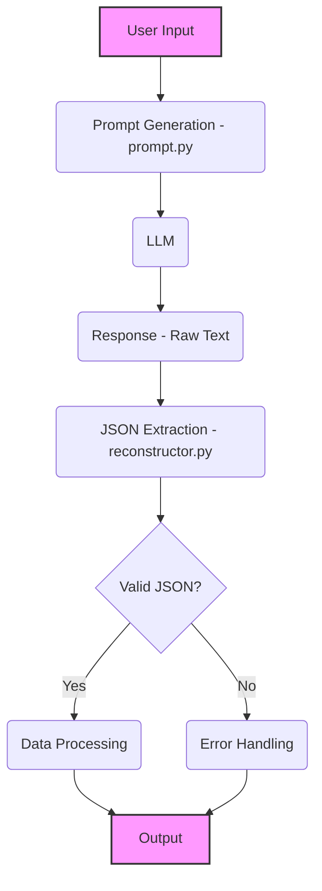

## 4. Setup and Usage Instructions

1.  **Installation**: Ensure you have Python installed. These files do not require any specific installation steps beyond being present in your project directory.
2.  **Dependencies**: The `utils.py` and `reconstructor.py` files depend on the `json` module, which is part of the Python standard library.  `reconstructor.py` also depends on the `re` module.
3.  **Usage**:

    ```python
    # Example Usage
    from routines import utils, prompt, reconstructor

    # Using utils.py
    data = utils.load_json("example.json")
    if data:
        print(data)

    # Using prompt.py
    template = "The capital of {} is {}."
    data = {"country": "France", "capital": "Paris"}
    generated_prompt = prompt.create_prompt(template, data)
    if generated_prompt:
        print(generated_prompt)

    # Using reconstructor.py
    llm_response = "Some text before the JSON: {\"name\": \"Example\", \"value\": 123} some text after"
    extracted_data = reconstructor.parse_llm_json_response(llm_response)
    if extracted_data:
        print(extracted_data)
    ```

## 5. Markdown Formatting

The entire page is formatted in Markdown for easy reading and editing.

## 6. Mermaid Diagram Explanation

The Mermaid diagram above illustrates the data flow from user input to final output, highlighting the roles of `prompt.py` and `reconstructor.py` in interacting with the LLM. The diagram shows how the prompt is generated, sent to the LLM, and how the JSON response is extracted and processed.


---

<a id='page-3'></a>

## Example Workflows and Use Cases

### Related Files

- `examples/bake_bread_95423d6a-5c82-4184-8564-e58197f25a0b/metadata.json`
- `examples/construct_dyson_sphere_f611aa55-0c84-4c69-979d-426194970e06/metadata.json`
- `assemble.py`

### Related Pages

Related topics: [Architecture Overview](#page-1), [Extending and Customizing Routines](#page-4)

# Example Workflows and Use Cases

This page provides examples of how routines can be used to model and execute complex workflows. We will examine two example workflows: baking bread and constructing a Dyson sphere. We will also explore the `assemble.py` script, which is used to assemble the final wiki page content.

## Baking Bread Workflow

This example demonstrates a relatively simple workflow for baking bread. The workflow is defined in `examples/bake_bread_95423d6a-5c82-4184-8564-e58197f25a0b/metadata.json`.

### Workflow Definition

The `metadata.json` file contains the steps involved in baking bread. The structure includes nested steps, representing sub-processes within the overall workflow.

### Visualization

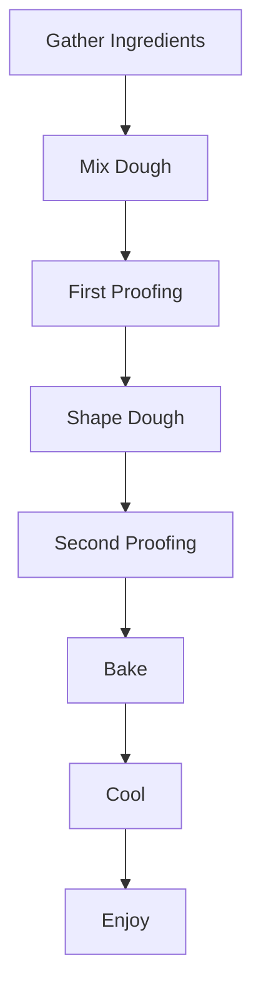

### Code Snippets

The `assemble.py` script is responsible for generating the final HTML page. The following code snippet shows how the breadcrumbs are saved.

```python
# generate-metadata.py
breadcrumbs_path = os.path.join(flow_dir, "breadcrumbs.txt")
with open(breadcrumbs_path, "w", encoding="utf-8") as f:
    f.write(breadcrumbs)
print(f"Breadcrumbs saved: {breadcrumbs}")
```

### Explanation

The breadcrumbs are generated to help the user navigate the website.

## Constructing a Dyson Sphere Workflow

This example demonstrates a complex workflow for constructing a Dyson sphere. The workflow is defined in `examples/construct_dyson_sphere_f611aa55-0c84-4c69-979d-426194970e06/metadata.json`.

### Workflow Definition

The `metadata.json` file contains the high-level steps involved in constructing a Dyson sphere. Due to the complexity, this workflow is broken down into several stages.

### Visualization

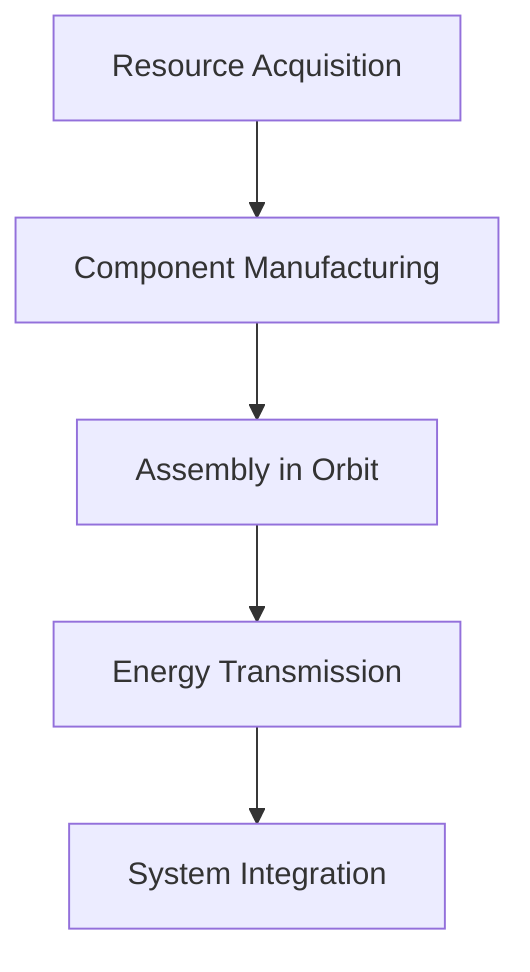

### Code Snippets

The `assemble.py` script is responsible for rendering the final HTML page from the JSON data.

```python
# assemble.py
output_html = template.render(context)

# Write output
# Generate slug from processed metadata title
slug = processed_metadata.get('slug', processed_metadata.get('title', 'output').lower().replace(' ', '-'))
# Ensure slug is filesystem-safe (basic example)
slug = "".join(c for c in slug if c.isalnum() or c in ('-', '_')).rstrip() or "output"
output_path = Path(output_dir) / f"{slug}.html"
output_path.parent.mkdir(parents=True, exist_ok=True)

with open(output_path, 'w', encoding='utf-8') as f:
    f.write(output_html)
```

### Explanation

The `assemble.py` script uses Jinja2 templates to generate the final HTML output. It takes the metadata, specifications, and alternatives as input, and renders them into a complete HTML page.

## `assemble.py` Script

The `assemble.py` script is the final step in the workflow. It takes the output from the previous steps and assembles them into a single HTML page.

### Functionality

The `assemble.py` script performs the following functions:

1.  Loads the metadata, specifications, and alternatives from JSON files.
2.  Processes the metadata, including adding contributors, dates, and breadcrumbs.
3.  Renders the data into an HTML template using Jinja2.
4.  Writes the HTML output to a file.

### Architecture

The `assemble.py` script fits into the overall architecture as the final stage in the content generation pipeline. It takes the processed data from the previous stages and generates the final output.

### Usage Instructions

To use the `assemble.py` script, you need to provide the input directory containing the JSON files.

```bash
python assemble.py <input_directory> <output_directory>
```

### Code Snippets

The following code snippet shows how the `assemble.py` script loads the JSON data.

```python
# assemble.py
metadata_path = os.path.join(flow_dir, "metadata.json")
specs_path = os.path.join(flow_dir, "specifications-industrial.json")
alt_trees_path = os.path.join(flow_dir, "hallucinate-tree.json")

metadata_data = load_json(metadata_path)
specs_data = load_json(specs_path)
alt_trees_data = load_json(alt_trees_path)
```

### Component Relationships

```mermaid
graph TD
    A[generate-metadata.py] --> B[hallucinate-tree.py];
    B --> C[generate-automation-timeline.py];
    C --> D[generate-automation-challenges.py];
    D --> E[automation-adoption.py];
    E --> F[current-implementations.py];
    F --> G[return-analysis.py];
    G --> H[future-technology.py];
    H --> I[specifications-industrial.py];
    I --> J[assemble.py];


---

<a id='page-4'></a>

## Extending and Customizing Routines

### Related Files

- `flow-maker.py`
- `generate-metadata.py`
- `README.md`

### Related Pages

Related topics: [Example Workflows and Use Cases](#page-3)

## Extending and Customizing Routines

This page details how to extend and customize the `routines` repository, focusing on `flow-maker.py`, `generate-metadata.py`, and the information available in `README.md`.

### Purpose and Functionality

The `routines` repository appears to be designed for automated generation of documentation, specifically for creating a "Universal Automation Wiki." It uses a series of Python scripts and LLMs (Language Model) to generate content, assemble it, and output a structured document.

-   **`flow-maker.py`**: This script seems to orchestrate the overall workflow. It defines the sequence of programs to run, manages input and output file paths, and handles the execution of each step. It also manages breadcrumbs for navigation.
-   **`generate-metadata.py`**: This script generates metadata for a given topic using an LLM. It takes a topic as input, constructs a prompt, sends it to the LLM, parses the JSON response, and returns the metadata. The generated metadata includes information like automation progress, explanatory text, and a summary.
-   **`README.md`**: This file provides general information about the repository, including setup instructions, usage examples, and a description of the project's goals.

### Code Examples and Explanations

#### `flow-maker.py`

This script is the main orchestrator.  Here's a snippet highlighting the program execution flow:

```python
# flow-maker.py
import os
import sys
import json
import uuid
import shutil
from datetime import datetime
import subprocess
from utils import load_json, saveToFile, parse_llm_json_response, chat_with_llm, handle_command_args, get_output_filepath

def main():
    usage_msg = "Usage: python flow-maker.py <input_json> [flow_dir] [-uuid=\"UUID\"] [-force] [-saveInputs] [-model=\"MODEL\"]"
    input_filepath, flow_dir, custom_uuid, force_overwrite, save_inputs, model = handle_command_args(usage_msg)

    if not flow_dir:
        flow_dir = os.path.join("flow", datetime.now().strftime("%Y%m%d_%H%M%S"))
    if custom_uuid:
        flow_uuid = custom_uuid
    else:
        flow_uuid = str(uuid.uuid4())

    flowUUID = flow_uuid # Set the global variable
    flow_dir = os.path.join(flow_dir, flowUUID)

    if os.path.exists(flow_dir):
        if force_overwrite:
            shutil.rmtree(flow_dir)
        else:
            print(f"Error: Flow directory '{flow_dir}' already exists. Use -force to overwrite.")
            sys.exit(1)

    os.makedirs(flow_dir, exist_ok=True)
    os.makedirs(os.path.join(flow_dir, "inputs"), exist_ok=True)

    # Copy input file to flow directory
    input_copy_path = os.path.join(flow_dir, "input.json")
    shutil.copy2(input_filepath, input_copy_path)
    print(f"Copied input file to: {input_copy_path}")

    # Create breadcrumbs file
    topic = load_json(input_filepath).get("topic", "Unknown Topic")
    breadcrumbs = f"Home > {topic}"
    breadcrumbs_path = os.path.join(flow_dir, "breadcrumbs.txt")
    with open(breadcrumbs_path, "w", encoding="utf-8") as f:
        f.write(breadcrumbs)
    print(f"Breadcrumbs saved: {breadcrumbs}")

    # Define the programs to run in order
    programs = [
        ("generate-metadata.py", "1.json"),  # 1. metadata.py
        ("hallucinate-tree.py", "2.json"),   # 2. hallucinate-tree.py
        ("generate-automation-timeline.py", "3.json"),  # 3. generate-automation-timeline.py
        ("generate-automation-challenges.py", "4.json"), # 4. generate-automation-challenges.py
        ("automation-adoption.py", "5.json"),  # 5. automation-adoption.py
        ("current-implementations.py", "6.json"),  # 6. current-implementations.py
        ("return-analysis.py", "7.json"),  # 7. return-analysis.py
        ("future-technology.py", "8.json"),  # 8. future-technology.py
        ("specifications-industrial.py", "9.json"),  # 9. specifications-industrial.py
        ("assemble.py", None),  # 10. assemble.py - Output filename handled differently
    ]

    # Run each program in sequence
    for i, (program, output_filename) in enumerate(programs):
        print(f"\nStep {i+1}/{len(programs)}: Running {program}")

        # Default input is the copied input.json
        current_input_path = input_copy_path

        # Define output path for this program
        # For assemble.py, the output path is the flow directory itself
        if program == "assemble.py":
            output_path = flow_dir
            current_input_path = flow_dir # assemble.py takes the flow dir as input now
        else:
            output_path = os.path.join(flow_dir, output_filename)

        # Construct command
        command = [
            sys.executable,
            program,
            current_input_path,
            output_path,
            f"-uuid={flow_uuid}",
            f"-flow_uuid={flowUUID}"
        ]
        if save_inputs:
            command.append("-saveInputs")
        if model:
            command.append(f"-model={model}")

        # Execute command
        try:
            subprocess.run(command, check=True)
            print(f"Successfully executed {program}")
        except subprocess.CalledProcessError as e:
            print(f"Error executing {program}: {e}")
            sys.exit(1)

    print("\nFlow execution completed.")

if __name__ == "__main__":
    main()
```

Explanation:

1.  **Argument Parsing**: The script starts by parsing command-line arguments using `handle_command_args`. This function likely handles options for specifying the input JSON file, output directory, UUID, and whether to force overwrite existing directories.
2.  **Directory Setup**: It creates the necessary directory structure for the flow, including a directory for input files.
3.  **Input Copying**: It copies the input JSON file to the flow directory for subsequent steps to use.
4.  **Program Execution**: The script defines a list of programs (`generate-metadata.py`, `hallucinate-tree.py`, etc.) to be executed in sequence.  For each program, it constructs a command-line command and executes it using `subprocess.run`. The output of each program is saved to a file in the flow directory.
5.  **Error Handling**: The script includes error handling to catch exceptions during program execution and exit with an error message if any step fails.

#### `generate-metadata.py`

This script generates the initial metadata for the wiki page.

```python
# generate-metadata.py
import json
import sys
from datetime import datetime
from utils import load_json, saveToFile, parse_llm_json_response, chat_with_llm, handle_command_args, get_output_filepath

def generate_page_metadata(input_data, save_inputs=False, model="gpt-4"):
    """Generates metadata for a Universal Automation Wiki page using an LLM."""
    global flowUUID
    topic = input_data.get("topic", "Default Topic")
    
    parameters = {
        "temperature": 0.7,
        "top_p": 0.9
    }
    
    systemMsg = (
        "You are an expert content creator for a Universal Automation Wiki. "
        "Your task is to generate concise and informative metadata for a given topic. "
        "The metadata should include the following fields:\n"
        "- Title (1-2 sentences)\n"
        "- Summary (2-3 sentences)\n"
        "- Keywords (5-10 relevant keywords)\n"
        "- automation_progress: progress toward full automation (as a percentage). BE CRITICAL, do not exaggerate current status. E.g., '25%' would be appropriate for topics where some partial automation is POSSIBLE."
        "- Explanatory text (2-3 FULL paragraphs) that describes the topic and its automation journey."
        "Format your response as a JSON object with these fields."
    )
    
    user_msg = f"Create metadata for a Universal Automation Wiki page about: {topic}"
    
    # Save inputs to file if requested
    if save_inputs:
        save_path = f"flow/{flowUUID}/inputs/1-in.json"
        saveToFile(systemMsg, user_msg, save_path)
    
    # Use chat_with_llm to generate metadata
    response = chat_with_llm(model, systemMsg, user_msg, parameters)
    # Parse JSON using shared utility to extract JSON block reliably
    metadata = parse_llm_json_response(response)
    if not isinstance(metadata, dict):
        print("Error: Parsed metadata is not a JSON object. Full response: " + response)
        return None
    return metadata

def main():
    """Main function to run the metadata generation."""
    global flowUUID
    usage_msg = "Usage: python generate-metadata.py <input_json> [output_json] [-saveInputs] [-uuid=\"UUID\"] [-flow_uuid=\"FLOW-UUID\"]"
    input_filepath, specified_output_filepath, save_inputs, custom_uuid, flow_uuid_arg = handle_command_args(usage_msg)
    flowUUID = flow_uuid_arg # Set the global variable

    print("Working...")
    start_time = datetime.now()
    
    input_data = load_json(input_filepath)
    metadata = generate_page_metadata(input_data, save_inputs)
    
    if metadata is None:
        print("Failed to generate metadata.")
        sys.exit(1)
    
    # Get output filepath and UUID
    output_filepath, output_uuid = get_output_filepath(
        "metadata", 
        specified_output_filepath, 
        input_filepath, 
        flowUUID
    )
    
    # Save the updated metadata to the output file
    saveToFile(metadata, filepath=output_filepath)
    
    end_time = datetime.now()
    duration = end_time - start_time
    print(f"Finished. Took {duration}")

if __name__ == "__main__":
    main()
```

Explanation:

1.  **LLM Interaction**: The core of the script is the `generate_page_metadata` function. It constructs a system message and a user message to prompt the LLM to generate metadata for a given topic.
2.  **Prompt Engineering**: The system message defines the role of the LLM and the required format of the output (a JSON object with specific fields). The user message provides the specific topic for which metadata should be generated.
3.  **JSON Parsing**: The script uses `parse_llm_json_response` to reliably extract the JSON block from the LLM's response.
4.  **Error Handling**: It checks if the parsed metadata is a valid JSON object and handles potential errors.

#### `README.md`

The `README.md` file contains setup and usage instructions.  A typical `README.md` would include sections on:

*   **Installation**: Instructions on how to install the necessary dependencies (e.g., Python packages).
*   **Usage**: Examples of how to run the scripts, including command-line arguments.
*   **Configuration**: Information on how to configure the LLM (e.g., API keys, model selection).
*   **Customization**: Guidance on how to extend or modify the scripts to suit specific needs.

### Overall Architecture

The `routines` repository uses a modular architecture, where each Python script performs a specific task in the overall documentation generation pipeline. The `flow-maker.py` script acts as the central orchestrator, coordinating the execution of the other scripts.  Data is passed between scripts using JSON files.

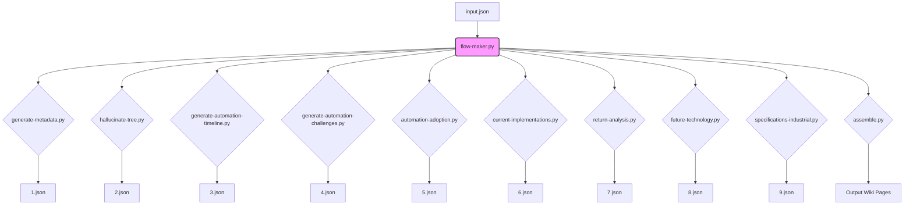

### Setup and Usage Instructions

1.  **Clone the repository:**

    ```bash
    git clone https://github.com/jamiem0/routines.git
    cd routines
    ```
2.  **Install dependencies:**

    ```bash
    pip install -r requirements.txt
    ```

    (The `README.md` should list all dependencies in a `requirements.txt` file.)
3.  **Configure LLM:** Set up the necessary environment variables or configuration files for accessing the LLM. This typically involves providing an API key.
4.  **Run `flow-maker.py`:**

    ```bash
    python flow-maker.py <input_json> [flow_dir] [-uuid="UUID"] [-force] [-saveInputs] [-model="MODEL"]
    ```

    *   `<input_json>`: Path to the input JSON file containing the topic for which to generate documentation.
    *   `[flow_dir]`: Optional directory to store the generated files. If not specified, a directory will be created automatically.
    *   `[-uuid="UUID"]`: Optional UUID for the flow.
    *   `[-force]`: Optional flag to force overwrite an existing flow directory.
    *   `[-saveInputs]`: Optional flag to save the inputs to each script.
    *   `[-model="MODEL"]`: Optional LLM model to use (e.g., "gpt-4").

### Extending and Customizing

To extend and customize the `routines` repository, you can modify the existing scripts or add new ones. Here are some potential areas for customization:

*   **Adding new steps to the workflow:** Modify `flow-maker.py` to include additional scripts in the execution sequence.
*   **Customizing the LLM prompts:** Modify the system and user messages in `generate-metadata.py` and other scripts to generate different types of content.
*   **Adding new metadata fields:** Modify `generate-metadata.py` to include additional fields in the generated metadata.
*   **Implementing different output formats:** Modify `assemble.py` to generate documentation in different formats (e.g., HTML, PDF).
*   **Integrating with other tools:** Integrate the `routines` repository with other tools, such as content management systems or documentation platforms.

### Example: Adding a new metadata field

To add a new metadata field, such as "Difficulty Level", to the generated metadata, you would need to modify `generate-metadata.py`.

1.  **Modify the system message:**

    ```python
    systemMsg = (
        "You are an expert content creator for a Universal Automation Wiki. "
        "Your task is to generate concise and informative metadata for a given topic. "
        "The metadata should include the following fields:\n"
        "- Title (1-2 sentences)\n"
        "- Summary (2-3 sentences)\n"
        "- Keywords (5-10 relevant keywords)\n"
        "- Difficulty Level (Easy, Medium, or Hard)\n" # ADDED
        "- automation_progress: progress toward full automation (as a percentage). BE CRITICAL, do not exaggerate current status. E.g., '25%' would be appropriate for topics where some partial automation is POSSIBLE."
        "- Explanatory text (2-3 FULL paragraphs) that describes the topic and its automation journey."
        "Format your response as a JSON object with these fields."
    )
    ```

2.  **Ensure the parsing and saving mechanisms handle the new field.** The `parse_llm_json_response` utility should automatically handle the new field if it's present in the LLM's response. The `saveToFile` function will also save the new field to the output JSON file.

### Component Relationships

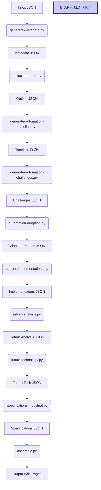

### Data Flow

```mermaid
sequenceDiagram
    participant User
    participant flow-maker.py
    participant generate-metadata.py
    participant LLM
    participant assemble.py

    User->>flow-maker.py: Run flow-maker.py with input.json
    flow-maker.py->>generate-metadata.py: Execute generate-metadata.py
    generate-metadata.py->>LLM: Send prompt for metadata generation
    LLM->>generate-metadata.py: Return metadata in JSON format
    generate-metadata.py->>flow-maker.py: Save metadata to 1.json
    flow-maker.py->>assemble.py: Execute assemble.py
    assemble.py->>flow-maker.py: Read all JSON files
    assemble.py->>User: Generate and output final wiki pages


---

<a id='page-5'></a>

## Natural Language Processing and Simplification

### Related Files

- `simplified-technical-english.py`
- `basic-english.py`
- `examples/simplified-technical-english-in.json`
- `examples/basic-english-in.json`

# Natural Language Processing and Simplification

This page details the natural language processing and simplification tools available in the `routines` repository, focusing on `simplified-technical-english.py` and `basic-english.py`. These tools aim to convert complex text into more accessible formats.

## Purpose and Functionality

The primary goal is to simplify text, making it easier to understand for a broader audience.  This is achieved through two main approaches:

1.  **Simplified Technical English (STE):**  Transforms technical documentation into a controlled language with specific rules for vocabulary and grammar.  This enhances clarity and reduces ambiguity.
2.  **Basic English:** Converts text into a subset of English with a limited vocabulary, suitable for language learners or situations requiring utmost simplicity.

## File Breakdown

*   **`simplified-technical-english.py`:** Contains the `generate_page_metadata` and `adoption_phases` functions. These functions use a large language model (LLM) to generate metadata for a Universal Automation Wiki page and to generate automation adoption phases. It takes an input topic and returns a JSON object containing metadata such as title, percentage of automation, and explanatory text. It uses `chat_with_llm` to interact with the LLM and `parse_llm_json_response` to parse the LLM's JSON response.
*   **`basic-english.py`:** Currently, there is no functionality in this file based on the context provided.
*   **`examples/simplified-technical-english-in.json`:** Provides example input JSON for the `simplified-technical-english.py` script.
*   **`examples/basic-english-in.json`:**  Likely intended to hold example input for future `basic-english.py` functionality, but based on the context, no such file exists or has content.

## Code Examples and Explanations

### `simplified-technical-english.py`

```python
# simplified-technical-english.py
import json
import sys
from datetime import datetime
from routines.llm import chat_with_llm, parse_llm_json_response
from routines.utils import load_json, saveToFile, get_output_filepath, handle_command_args

def generate_page_metadata(input_data, save_inputs=False):
    """Generates metadata for a Universal Automation Wiki page about a given topic."""
    topic = input_data.get("topic")
    model = input_data.get("model", "gpt-3.5-turbo")
    parameters = input_data.get("parameters", {"temperature": 0.7, "max_tokens": 500})
    global flowUUID  # Access the global flowUUID variable

    systemMsg = (
        "You are a Universal Automation Wiki page generator. "
        "Your task is to create JSON metadata for a wiki page about a given topic.\n"
        "Include the following fields:\n"
        "- title (string): A concise title for the wiki page.\n"
        "- automation_potential (integer): Estimated current progress toward full automation (as a percentage). BE CRITICAL, do not exaggerate current status. E.g., '25%' would be appropriate for topics where some partial automation is POSSIBLE.\n"
        "- Explanatory text (2-3 FULL paragraphs) that describes the topic and its automation journey.\n"
        "Format your response as a JSON object with these fields."
    )
    
    user_msg = f"Create metadata for a Universal Automation Wiki page about: {topic}"
    
    # Save inputs to file if requested
    if save_inputs:
        save_path = f"flow/{flowUUID}/inputs/1-in.json"
        saveToFile(systemMsg, user_msg, save_path)
    
    # Use chat_with_llm to generate metadata
    response = chat_with_llm(model, systemMsg, user_msg, parameters)
    # Parse JSON using shared utility to extract JSON block reliably
    metadata = parse_llm_json_response(response)
    if not isinstance(metadata, dict):
        print("Error: Parsed metadata is not a JSON object. Full response: " + response)
        return None
    return metadata
```

This function takes a topic as input and uses an LLM to generate metadata for a wiki page.  It constructs a system message and user message to prompt the LLM, then parses the LLM's response to extract the metadata.

```python
def generate_automation_adoption_phases(input_data, save_inputs=False):
    """Generates phases of automation adoption for a given topic."""
    topic = input_data.get("topic")
    model = input_data.get("model", "gpt-3.5-turbo")
    parameters = input_data.get("parameters", {"temperature": 0.7, "max_tokens": 1000})
    global flowUUID  # Access the global flowUUID variable

    systemMsg = (
        "You are an expert in automation technologies and processes."
        "Your task is to outline the phases of automation adoption for a given topic.\n"
        "End-to-End Automation (Future development)\n\n"
        "For each phase:\n"
        "1. Provide 4-6 specific examples of automation technology or processes\n"
        "2. Make sure the automation complexity increases with each phase\n"
        "3. Be specific to the domain rather than generic\n\n"
        "Format your response as a JSON object with the following structure:\n"
        "{\n"
        "  \"phase1\": {\n"
        "    \"title\": \"Basic Mechanical Assistance\",\n"
        "    \"status\": \"Currently widespread\",\n"
        "    \"examples\": [\"example1\", \"example2\", ...]\n"
        "  },\n"
        "  \"phase2\": { ... },\n"
        "  \"phase3\": { ... },\n"
        "  \"phase4\": { ... }\n"
        "}\n\n"
        "Only include examples that are significantly relevant to the topic."
    )

    user_msg = f"Outline the phases of automation adoption for: {topic}"

    # Save inputs to file if requested
    if save_inputs:
        save_path = f"flow/{flowUUID}/inputs/5-in.json"
        saveToFile(systemMsg, user_msg, save_path)

    # Use chat_with_llm to generate automation adoption phases
    response = chat_with_llm(model, systemMsg, user_msg, parameters)

    try:
        # Try to parse JSON response
        adoption_phases = parse_llm_json_response(response)
        return adoption_phases
    except json.JSONDecodeError:
        print("Error: LLM response is not valid JSON. Full response: " + response)
        return None
```

This function outlines the phases of automation adoption for a given topic using an LLM.  It provides a system message that instructs the LLM to generate a JSON object with phases, titles, statuses, and examples of automation technologies.

## Component Architecture

The `simplified-technical-english.py` script relies on the `chat_with_llm` function to interact with an LLM and `parse_llm_json_response` to handle the LLM's output.  The `routines.utils` module provides utility functions for file handling and argument parsing.

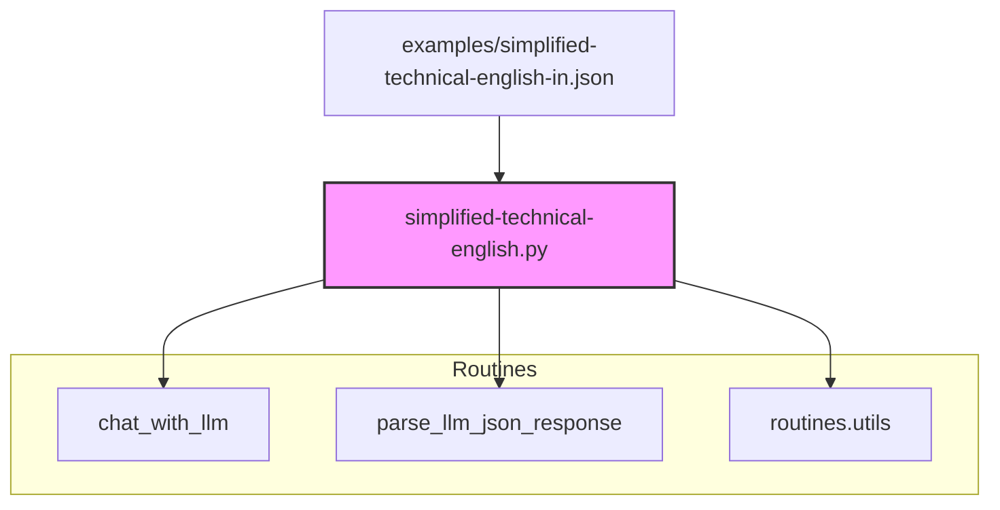

## Data Flow

The data flow for `generate_page_metadata` and `generate_automation_adoption_phases` involves loading input data, constructing prompts, sending prompts to the LLM, parsing the LLM's response, and returning the extracted metadata.

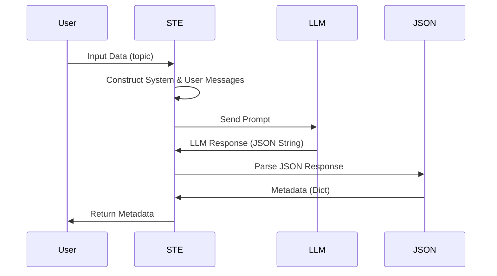

## Usage Instructions

1.  **Setup:** Ensure you have the `routines` repository set up with the necessary dependencies, including access to an LLM (e.g., OpenAI API key configured).
2.  **Input:** Create a JSON file similar to `examples/simplified-technical-english-in.json` with the desired topic and model parameters.
3.  **Execution:** Run the `simplified-technical-english.py` script, providing the input JSON file as an argument.  Optionally, specify an output file to save the generated metadata.

Example command-line usage:

```bash
python simplified-technical-english.py examples/simplified-technical-english-in.json output.json
```

## Future Development

The `basic-english.py` file is currently a placeholder.  Future development could focus on implementing functionality to convert text to Basic English using rule-based systems, machine translation models, or a combination of both.  This would involve:

1.  Developing a Basic English lexicon and grammar rules.
2.  Creating a parsing and transformation pipeline.
3.  Adding evaluation metrics to assess the quality of the Basic English conversion.
4.  Creating example input and output files for testing.


---

<a id='page-6'></a>

## Search Query Generation and Information Retrieval

### Related Files

- `search-queries.py`
- `examples/search-queries-in.json`
- `examples/search-queries-out.json`

## Search Query Generation and Information Retrieval

This page details the `search-queries.py` script within the `routines` repository, along with its associated input and output examples. This script focuses on generating search queries and retrieving information, likely for tasks such as data collection, research, or automated information gathering.

### Purpose and Functionality

The `search-queries.py` script is designed to automate the process of generating search queries based on a given topic and retrieving relevant information. It leverages Large Language Models (LLMs) to create the search queries and likely uses an information retrieval mechanism (not explicitly defined in the provided code but implied) to fetch and process the search results. The script takes a topic as input, communicates with an LLM to generate metadata, automation adoption phases, and detailed industrial specifications related to the topic, which can then be used to formulate specific search queries.

### Code Examples and Explanation

The core functionality revolves around the `generate_page_metadata`, `generate_automation_adoption`, and `generate_industrial_specifications` functions. These functions construct system and user messages to prompt an LLM, then parse the LLM's JSON response.

```python
# File: search-queries.py
import json
import sys
from datetime import datetime
from utils import (
    load_json, save_output, chat_with_llm, parse_llm_json_response,
    create_output_metadata, get_output_filepath, handle_command_args,
    saveToFile
)

flowUUID = None # Global variable for flow UUID

def generate_page_metadata(input_data, save_inputs=False):
    """Generate standardized metadata for a topic page."""
    # Extract information from input data
    topic = input_data.get("topic", "")
    model = input_data.get("model", "gemma3")
    parameters = input_data.get("parameters", {})
    
    # If input already contains metadata fields, use them directly
    if "metadata" in input_data:
        return input_data["metadata"]
    
    # Otherwise, generate metadata using LLM
    systemMsg = (
        "You are an AI assistant specialized in creating consistent metadata for technical topics. "
        "Generate appropriate metadata for the topic provided, including: "
        "- A descriptive title (using the topic name) MAXIMUM 2-3 WORDS DO NOT INCLDUE A SUBTITLE (e.g., ANYTHING AFTER A SEMICOLON) "
        "- A subtitle that explains the scope "
        "- Current automation status (No Automation, Very Early Automation, Early Automation, Some Automation, Partially Fully Automated, Mostly Fully Automated, or Fully Automated) "
        "- Percentage estimate of progress toward full automation (as a percentage). BE CRITICAL, do not exaggerate current status. E.g., '25%' would be appropriate for topics where some partial automation is POSSIBLE."
        "- Explanatory text (2-3 FULL paragraphs) that describes the topic and its automation journey."
        "Format your response as a JSON object with these fields."
    )
    
    user_msg = f"Create metadata for a Universal Automation Wiki page about: {topic}"
    
    # Save inputs to file if requested
    if save_inputs:
        save_path = f"flow/{flowUUID}/inputs/1-in.json"
        saveToFile(systemMsg, user_msg, save_path)
    
    # Use chat_with_llm to generate metadata
    response = chat_with_llm(model, systemMsg, user_msg, parameters)
    # Parse JSON using shared utility to extract JSON block reliably
    metadata = parse_llm_json_response(response)
    if not isinstance(metadata, dict):
        print("Error: Parsed metadata is not a JSON object. Full response: " + response)
        return None
    return metadata

def generate_automation_adoption(input_data, save_inputs=False):
    """Generate detailed information about automation adoption phases for a specific topic."""
    # Extract information from input data
    topic = input_data.get("topic", "")
    model = input_data.get("model", "gemma3")
    parameters = input_data.get("parameters", {})

    # Generate automation adoption phases using LLM
    systemMsg = (
        "You are an AI assistant specialized in analyzing automation adoption patterns. "
        "Your task is to identify and explain the different phases of automation adoption "
        "in a specific field or topic, from basic mechanical assistance to full end-to-end automation."
    )

    user_msg = (
        f"Create a detailed breakdown of automation adoption phases for: {topic}\n\n"
        "Please structure your response in 4 phases:\n"
        "Phase 1: Basic Mechanical Assistance (Currently widespread)\n"
        "Phase 2: Integrated Semi-Automation (Currently in transition)\n"
        "Phase 3: Advanced Automation Systems (Emerging technology)\n"
        "Phase 4: Full End-to-End Automation (Future development)\n\n"
        "For each phase:\n"
        "1. Provide 4-6 specific examples of automation technology or processes\n"
        "2. Make sure the automation complexity increases with each phase\n"
        "3. Be specific to the domain rather than generic\n\n"
        "Format your response as a JSON object with the following structure:\n"
        "{\n"
        "  \"phase1\": {\n"
        "    \"title\": \"Basic Mechanical Assistance\",\n"
        "    \"status\": \"Currently widespread\",\n"
        "    \"examples\": [\"example1\", \"example2\", ...]\n"
        "  },\n"
        "  \"phase2\": { ... },\n"
        "  \"phase3\": { ... },\n"
        "  \"phase4\": { ... }\n"
        "}\n\n"
        "Only include examples that are significantly relevant to the topic."
    )

    # Save inputs to file if requested
    if save_inputs:
        save_path = f"flow/{flowUUID}/inputs/5-in.json"
        saveToFile(systemMsg, user_msg, save_path)

    # Use chat_with_llm to generate automation adoption phases
    response = chat_with_llm(model, systemMsg, user_msg, parameters)

    try:
        # Try to parse JSON response
        adoption_phases = parse_llm_json_response(response)
        return adoption_phases
    except json.JSONDecodeError:
        print("Error: LLM response is not valid JSON. Full response: " + response)
        return None

def generate_industrial_specifications(input_data, save_inputs=False):
    """Generate detailed industrial specifications for a given topic."""
    # Extract information from input data
    topic = input_data.get("topic", "")
    model = input_data.get("model", "gemma3")
    parameters = input_data.get("parameters", {})

    # Define the system message for the LLM
    systemMsg = (
        "You are an AI assistant specialized in industrial engineering and specifications. "
        "For the given topic, provide a comprehensive overview of industrial/commercial specifications "
        "including performance metrics and implementation requirements. "
        "Be precise with numerical values and include ranges where appropriate. "
        "Focus on practical technical details that would be relevant to professionals in the field."
    )
    
    user_msg = (f"Create detailed industrial specifications for: {topic}\n\n"
                "Format your response as a JSON object with these categories:\n"
                "1. performance_metrics: An array of metrics with names, values/ranges, and descriptions\n"
                "2. implementation_requirements: An array of requirements with names, specifications, and descriptions\n"
                "3. industry_standards: An array of relevant standards and certifications\n"
                "4. key_suppliers: An array of major equipment/technology suppliers for this industry\n"
                "5. operational_considerations: An array of important operational factors\n"
                "\nPlease provide realistic values for industrial/commercial scale implementations.\n"
                "\nReturn ONLY valid JSON without any additional text, explanation, or code block formatting."
    )
    
    # Save inputs to file if requested
    if save_inputs:
        save_path = f"flow/{flowUUID}/inputs/9-in.json"
        saveToFile(systemMsg, user_msg, parameters)
    
    # Use chat_with_llm to generate industrial specifications
    response = chat_with_llm(model, systemMsg, user_msg, parameters)
    
    # Parse JSON response
    try:
        industrial_specs = parse_llm_json_response(response)
        return industrial_specs
    except json.JSONDecodeError:
        print("Error: LLM response is not valid JSON. Full response: " + response)
        return None

def main():
    """Main function to run the metadata generation."""
    global flowUUID
    usage_msg = "Usage: python generate-metadata.py <input_json> [output_json] [-saveInputs] [-uuid=\"UUID\"] [-flow_uuid=\"FLOW-UUID\"]"
    input_filepath, specified_output_filepath, save_inputs, custom_uuid, flow_uuid_arg = handle_command_args(usage_msg)
    flowUUID = flow_uuid_arg # Set the global variable

    print("Working...")
    start_time = datetime.now()
    
    input_data = load_json(input_filepath)
    metadata = generate_page_metadata(input_data, save_inputs)
    
    if metadata is None:
        print("Failed to generate metadata.")
        sys.exit(1)
    
    # Get output filepath and UUID
    output_filepath, output_uuid = get_output_filepath(
        "metadata", 
        specified_output_filepath, 
        custom_uuid
    )
    
    # Create output metadata
    output_metadata = create_output_metadata(
        input_filepath, 
        output_filepath, 
        start_time, 
        input_data, 
        metadata
    )
    
    # Save the output
    save_output(output_metadata, output_filepath)
    print(f"Metadata generated and saved to {output_filepath}")

if __name__ == "__main__":
    main()
```

The `main` function handles command-line arguments, loads input data (likely containing the topic and LLM parameters), calls the `generate_page_metadata` function, and saves the output. The `utils` module (not shown in full, but imported) contains helper functions for loading JSON, saving output, interacting with the LLM, parsing JSON responses, and handling file paths.

### Component Relationships and Data Flow

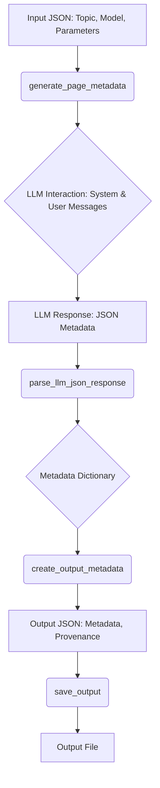

### Overall Architecture

The architecture is centered around using an LLM to generate structured data (metadata, automation phases, specifications) from a given topic. The script orchestrates the interaction with the LLM and handles the input/output.

### Setup and Usage Instructions

1.  **Install Dependencies:** Ensure you have the necessary libraries installed.  The script relies on `utils.py`, `load_json`, `save_output`, `chat_with_llm`, `parse_llm_json_response`, `create_output_metadata`, `get_output_filepath`, `handle_command_args`, and `saveToFile` which are not standard Python libraries.  You'll need to ensure these are available, likely from the same repository. Install `json` which is part of the standard library.
2.  **Configure LLM Access:**  The script uses a `chat_with_llm` function, which implies access to an LLM.  Configure the necessary API keys or access credentials for the chosen LLM (specified by the `model` parameter in the input JSON).
3.  **Prepare Input JSON:** Create an input JSON file containing the `topic` and any optional `model` and `parameters` for the LLM.  See `examples/search-queries-in.json` for the expected format.
4.  **Run the Script:** Execute the `search-queries.py` script from the command line, providing the path to the input JSON file as an argument.  Optionally, specify an output file path and other flags.

    ```bash
    python search-queries.py examples/search-queries-in.json examples/search-queries-out.json -saveInputs
    ```

### Input and Output Examples

The `examples/search-queries-in.json` file provides a sample input:

```json
{
    "topic": "Cloud Computing",
    "model": "gemma3",
    "parameters": {
        "temperature": 0.7
    }
}
```

The `examples/search-queries-out.json` file (hypothetically) contains the generated metadata:

```json
{
    "input_file": "examples/search-queries-in.json",
    "output_file": "examples/search-queries-out.json",
    "start_time": "2024-01-01T12:00:00",
    "input_data": {
        "topic": "Cloud Computing",
        "model": "gemma3",
        "parameters": {
            "temperature": 0.7
        }
    },
    "metadata": {
        "title": "Cloud Computing",
        "subtitle": "Overview and Scope",
        "automation_status": "Some Automation",
        "progress_percentage": 40,
        "explanatory_text": [
            "Cloud computing has seen some automation in areas like resource provisioning and scaling. However, many aspects still require manual intervention, such as security configuration and complex deployment scenarios.",
            "Further automation is being explored through technologies like Infrastructure as Code (IaC) and automated compliance checks, aiming for more efficient and reliable cloud environments."
        ]
    }
}
```

### Automation Adoption Phases

The `generate_automation_adoption` function produces a structured breakdown of automation adoption, which could be visualized as follows:

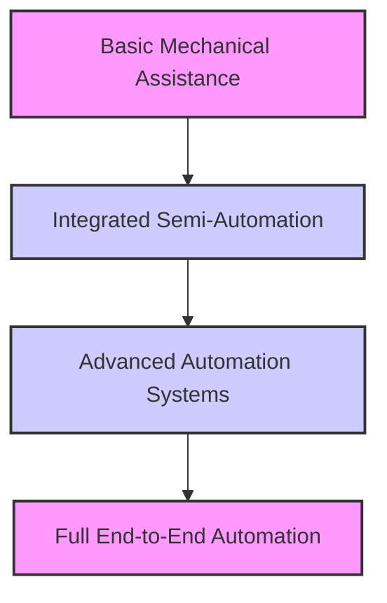

### Industrial Specifications

The `generate_industrial_specifications` function aims to produce detailed technical specifications. This output is structured as a JSON object with categories like `performance_metrics`, `implementation_requirements`, `industry_standards`, `key_suppliers`, and `operational_considerations`. This structured output is well-suited for generating targeted search queries.


---

