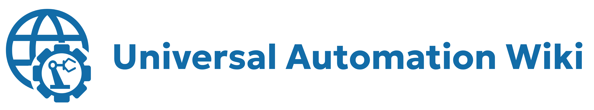
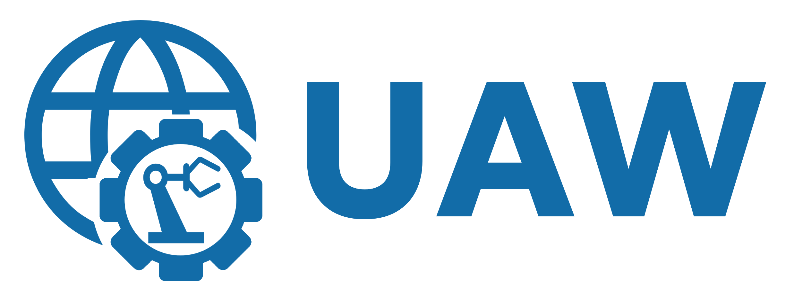

# Universal Automation Wiki Style Guide

This document outlines the official visual style, assets, and branding guidelines for the Universal Automation Wiki project. It serves as a central reference for the established design system.

## 1. Logo System

The UAW logo system is designed to be versatile and scalable, with variants for every required context. The primary font for all logotypes is **Geologica**.

### Primary Logos

These are the main logos for general use in site headers, documents, and presentations.

| Variant | Preview | Asset Path |
| :--- | :--- | :--- |
| **Primary Stacked** |  | `web/assets/images/logo-primary-stacked.png` |
| **Primary Inline** |  | `web/assets/images/logo-primary-inline.png` |

### Abbreviated Logos

Compact versions for use in smaller headers or when the brand is already established.

| Variant | Preview | Asset Path |
| :--- | :--- | :--- |
| **Abbreviated Stacked** |  | `web/assets/images/logo-abbrev-stacked.png` |
| **Abbreviated Inline** |  | `web/assets/images/logo-abbrev-inline.png` |

### Component Logos (Logomark & Wordmarks)

The core building blocks of the brand identity, allowing for flexible use.

| Variant | Preview | Asset Path |
| :--- | :--- | :--- |
| **Logomark** |  | `web/assets/images/logomark.png` |
| **Wordmark (Full)** |  | `web/assets/images/wordmark.png` |
| **Wordmark (Abbrev.)**|  | `web/assets/images/wordmark-abbrev.png` |

### Specialized Logos (Favicon)

Optimized for very small sizes, such as browser tabs and application icons.

| Variant | Preview | Asset Path |
| :--- | :--- | :--- |
| **Favicon** |  | `web/assets/images/favicon.png` |
| **Favicon HD** |  | `web/assets/images/favicon-hd.png` |

## 2. Color Palette

The color palette is designed for clarity, accessibility, and a professional aesthetic.

### Primary Colors

| Swatch | Role | Variable | Hex Code |
| :--- | :--- | :--- | :--- |
|  | Primary | `--primary-color` | `#126ca8` |
|  | Primary Light | `--primary-light` | `#1A8FCE` |
|  | Primary Dark | `--primary-dark` | `#074672` |
|  | Secondary | `--secondary-color`| `#444444` |

### Greyscale & Text

| Swatch | Role | Variable | Hex Code |
| :--- | :--- | :--- | :--- |
|  | Body Text | `--text-color` | `#333333` |
|  | Light Text | `--text-light` | `#666666` |
|  | Lighter Text | `--text-lighter` | `#888888` |
|  | Background | `--bg-color` | `#ffffff` |
|  | Light Background| `--bg-light` | `#f1f3f5` |
|  | Dark Background | `--bg-dark` | `#eeeeee` |
|  | Border | `--border-color` | `#e0e0e0` |

### System Feedback Colors

| Swatch | Role | Variable | Hex Code |
| :--- | :--- | :--- | :--- |
|  | Success | `--success-color` | `#28a745` |
|  | Error | `--error-color` | `#dc3545` |
|  | Warning | `--warning-color` | `#ffc107` |

## 3. Typography

The typographic system is built on a stack of three font families to ensure a clear hierarchy and excellent readability.

### Font Stack

| Role | Font Family | Example Weight(s) |
| :--- | :--- | :--- |
| **Logo** | `Geologica` | Bold (700), Black (900) |
| **Headings** | `IBM Plex Sans` | Bold (700), SemiBold (600) |
| **Body & UI** | `Inter` | Regular (400), Medium (500) |

### Application

-   **Body Text:** `Inter` at a regular (400) weight is used for all paragraphs and dense text areas to maximize legibility.
-   **Headings:** `IBM Plex Sans` is used for all headings (H1-H6) to provide a clear, structural contrast to the body text.
-   **Logo:** `Geologica` is reserved exclusively for the site logo to create a strong, memorable brand identity.