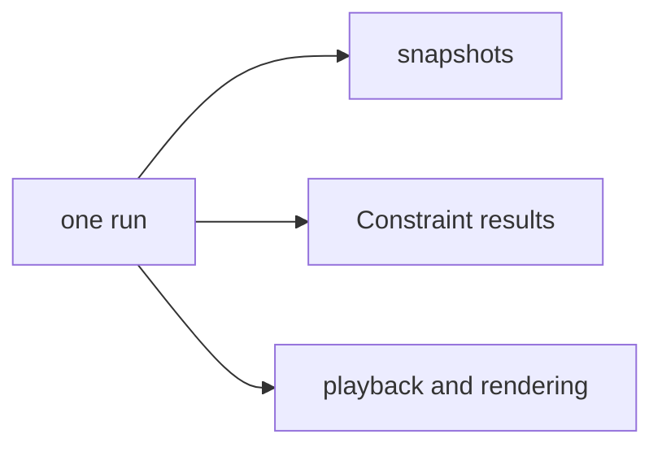

# Embed WorkSpec in another application

Embed the JavaScript API when your application must retain one run and inspect it in several ways.

## Define the trust boundary

Decide who supplies Starting State and executable source. Starting State is data. Changes, Generator, and Constraint files are JavaScript.

> **Warning:** Isolate untrusted executable source in a separate worker or process. Apply a wall-clock timeout and operating-system resource limits.

The package runtime executes project sources in process. Its work-unit budget cannot interrupt a synchronous callback that never returns.

Read [trusted code and execution security](/docs/workspec/sources/security/) before you accept uploaded projects.

## Validate before execution

Validate the Starting State first. Present document Problems before you compile or execute project source.

For trusted projects, validate the complete project with the intended seed, horizon, and budget. Preserve each Problem's structured fields for diagnostics.

See [validation APIs](/docs/api/validation/) for the supported calls.

## Create one authoritative run

Call `runtime.runProject()` once for a source set and run controls. Retain the returned run as the evidence object for that execution.

```js
const { runtime } = require("workspec");

const run = runtime.runProject(startingState, changes, generator, {
  seed: 17,
  until: 600,
  maxEvents: 20000
});
```

Use the [project execution API](/docs/api/runtime/) for the exact signature and result contract.

## Derive application views

Create snapshots from the existing run. Execute Constraints against that same run. Render state derived from the same history.



Do not use convenience calls that rerun the project when several outputs must agree.

## Enforce inspection boundaries

Compare each requested inspection time with `resolvedThrough`. A request after that boundary has no resolved evidence.

Expose `requestedHorizon`, `resolvedThrough`, `complete`, and budget accounting in logs or result metadata. These values make partial execution visible to callers.

## Keep public API assumptions narrow

Import only symbols classified as stable in the [JavaScript API index](/docs/api/reference/). A reachable package symbol is not automatically a supported embedding contract.
