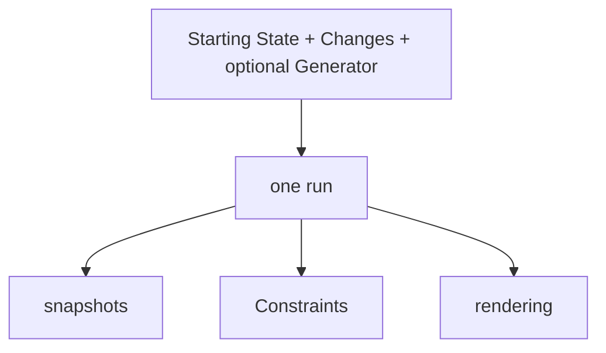

# What is WorkSpec?

WorkSpec is a language and runtime for describing work in an inspectable world.

You declare the starting objects, places, and planned tasks. You can then attach known effects, run the project, inspect its history, and test domain rules.

## The project model

The parts have separate jobs:

| Part | Job |
|---|---|
| Starting State | Declares the initial world and planned work. |
| Changes | Declares predetermined effects for known tasks. |
| Generator | Adds optional behavior that reacts to evolving state. |
| Runtime | Resolves tasks and records one authoritative history. |
| Constraints | Check domain rules against that resolved history. |
| Renderer | Presents resolved state without changing it. |

## The product surfaces

WorkSpec 2.2 is the language. The CLI validates and runs projects from a terminal. WorkSpec Studio provides visual editing and inspection.

The JavaScript package lets an application validate, run, inspect, and render a project directly.

## What WorkSpec validation means

A structurally valid file is not necessarily a valid world. Document validation checks the language contract. Constraints check facts such as safe inventory levels or required outcomes.

The [project model](/docs/workspec/project-model/) explains these boundaries in more detail.

## Next step

[Install and verify WorkSpec](/docs/start/install/) to prepare the CLI and JavaScript package.
