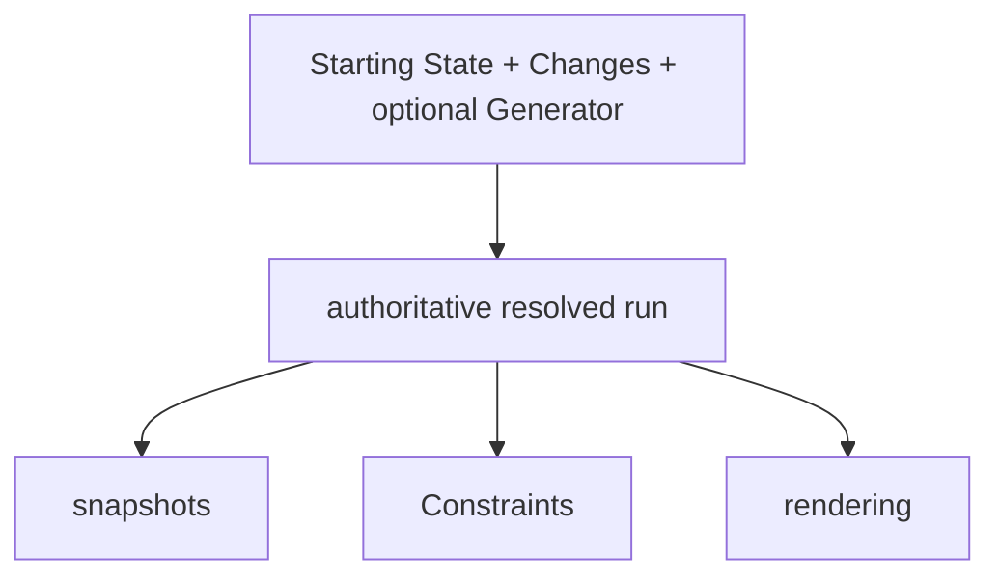

# Project model

The public WorkSpec model separates authored declarations from resolved execution.

## Model flow

Starting State declares the initial world and planned work. Changes attach known effects to task lifecycle events.

An optional Generator changes world state during execution. Constraints inspect the resulting state and history.

## Starting State

`start.workspec.json` declares objects, locations, task plans, collections, and reusable work definitions. It also declares metadata and global configuration.

Starting State remains declarative in WorkSpec 2.2. Inline `interactions`, `consumes`, `produces`, and `equipment_interactions` are not canonical 2.2 authoring.

## Resolved execution

The runtime produces one authoritative run. The run records history, task status, assignment history, reservations, runtime instances, and the resolution boundary.

A requested horizon can stop a run while later tasks remain unresolved. Consumers must not inspect time after `resolvedThrough`.

## Inspection

A snapshot is a view of an existing run at one resolved time. A renderer presents that snapshot and does not run another simulation.

A Constraint reads immutable evidence from the same run. It reports domain violations and does not modify state.

## Boundaries

This page states the current public model. It does not explain design history or alternative architectures.

See [Starting State](./starting-state/overview.md) for the document contract. See [trusted code and execution security](./sources/security.md) for executable-source risks.
